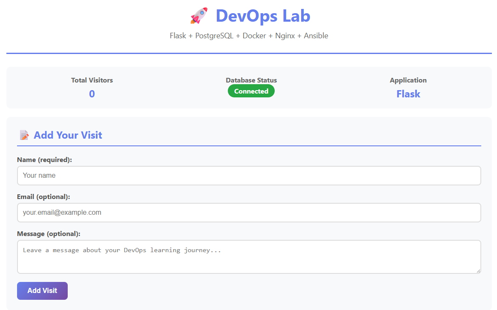
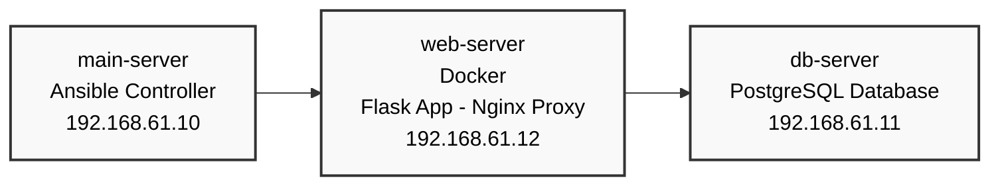

# Infrastructure DevOps Lab - Flask Web Application

This repository is representing a step on my own DevOps Roadmap. It demonstrates a complete DevOps workflow using containerization and automation tools. The goal was to create a setup that deploys a Flask web application with PostgreSQL database using Vagrant, Ansible, Docker, and Nginx. And since i wanted to go beyond the typical 'Hello World' projects, i made it a fully automated process and added e.g. the DB connection and the reverse proxe while still exploring multiple concepts of each tool. Thus, it is by any means not a production ready setup, but a nice little lab for exploring! 🚀

I tried to create it as a lab from which also other people might benefit from, so feel free to contribute! :wave:

## 🎬 Demo

[](demo/demo.mp4)


## 🏗️ Architecture Overview



## 🚀 Technology Stack

- **Infrastructure**: Vagrant + VirtualBox
- **Configuration Management**: Ansible
- **Containerization**: Docker + Docker Compose
- **Web Framework**: Python Flask
- **Database**: PostgreSQL 14
- **Reverse Proxy**: Nginx
- **VM Operating System**: Ubuntu 22.04 LTS
- **Host Operating System**: Windows 11

## 📦 Components

### Web Application (`web-server`)
- **Flask App Container**: Python 3.11 web application with PostgreSQL connectivity
- **Nginx Container**: Reverse proxy handling HTTP requests and load balancing
- **Docker Network**: Isolated network for secure container communication

### Database Server (`db-server`)
- **PostgreSQL 14**: Dedicated database server (not containerized)
- **Network Access**: Configured for connections from web server subnet

### Ansible Controller (`main-server`)
- **Automation Hub**: Orchestrates the entire infrastructure deployment
- **SSH Key Management**: Handles secure connections to target servers

## 🎯 Features Demonstrated

### DevOps Practices
- **Infrastructure as Code**: Vagrant for VM provisioning
- **Configuration Management**: Ansible playbooks and roles
- **Containerization**: Docker multi-container application

### Application Features
> Not the main repo purpose but i didn't want to just use a 'Hello World' app

- **Database Integration**: PostgreSQL connectivity with connection pooling
- **CRUD Operations**: Visitor registration and display 
- **RESTful API**: JSON endpoints for monitoring and integration
- **Health Checks**: Application and infrastructure monitoring endpoints

## 🚀 Quick Start

### Prerequisites
- VirtualBox installed
- Vagrant installed

### Deployment Steps

1. **Clone and Start VMs**
   ```bash
   git clone <repository-url>
   cd devops-infrastructure-lab
   vagrant up
   ```

2. **Run Ansible Deployment**
   ```bash
   vagrant ssh main
   cd /vagrant/ansible
   ansible-playbook playbooks/site.yml
   ```

3. **Access the Application**
   - Open browser to `http://localhost:8080`
   - The Flask app will be available through Nginx reverse proxy

## 🔧 Configuration

### Network Configuration
- **Main Server**: 192.168.61.10
- **Web Server**: 192.168.61.12 (Port 8080 forwarded)
- **DB Server**: 192.168.61.11
- **Docker Network**: webapp_network (bridge)

## 📊 Monitoring & Health Checks

### Application Endpoints
- `/` - Main application interface
- `/health` - Application health status
- `/api/stats` - Visitor statistics JSON API
- `/nginx-health` - Nginx proxy health check


## 📚 Learning Objectives

This lab was made by me to learn about following topics:
- **Vagrant**: Multi-VM orchestration and networking
- **Ansible**: Configuration management, roles, and playbooks
- **Docker**: Containerization, multi-container applications
- **Docker Compose**: Service orchestration and networking
- **Nginx**: Reverse proxy configuration and load balancing
- **PostgreSQL**: Database setup and remote connectivity
- **Flask**: Python web framework and database integration
- **DevOps**: Infrastructure as Code, automation, and monitoring

And i added a lot of comments that explain the different steps, maybe they help you as well! 

## 🔒 Security Considerations

I know this lab is far from 'production-ready'. This was not the goal, as i wanted to explore different topics
and concepts within these tools without focusing too much on security. Though, it's definitely a good practice to
do some considerations regarding security practices.

### Production Recommendations
- Change default passwords and use something secure, e.g. Ansible Vault
- Implement SSL/TLS certificates
- Use secrets management for sensitive data
- Regular security updates and vulnerability scanning
- Network segmentation and firewall rules
- Container image security

## 🤝 Contributing

This is a learning repository (also for me). Feel free to:
- Add new features to the Flask application
- Improve the Ansible playbooks
- Add monitoring and logging capabilities
- Implement CI/CD pipelines
- Add security enhancements
- Open issues or leave comments on what can be improved in general

## 📄 License

This project is open source and available under the [MIT License](LICENSE).

---

**Happy Learning! 🎓**